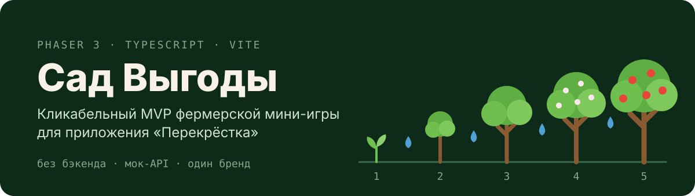
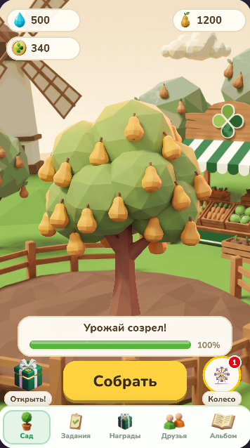
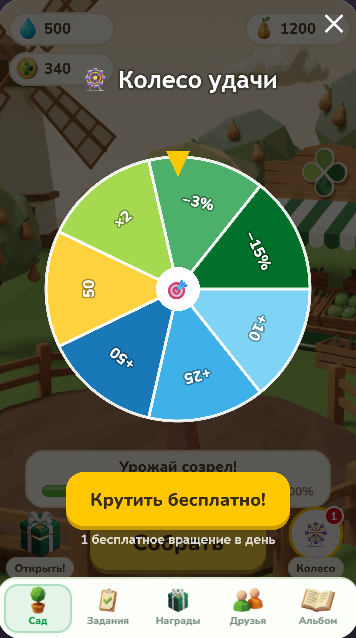
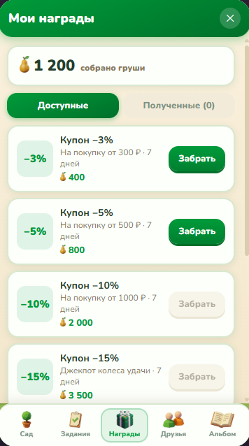

<p align="center">
  
</p>

<p align="center">
  <a href="https://frylockdev.github.io/wishing-tree/"><b>▶&nbsp;Играть в демо</b></a> — открывается в браузере, ставить ничего не нужно
</p>

<p align="center">
  
  
  
</p>

Игрок выращивает дерево: поливает его каплями, проходит 5 стадий роста, собирает
урожай и меняет его на купоны в витрине наград. Капли зарабатываются заданиями,
ежедневным входом, колесом удачи, сундуком и помощью друзей.

Это кликабельный MVP по GDD из `documents/` — бэкенда нет, вся серверная логика
эмулируется моковым API-слоем, состояние живёт в localStorage. При появлении
реального бэкенда меняется только реализация `ApiClient` — игра и UI не трогаются.

## Запуск

```bash
npm install
npm run dev      # http://localhost:5173 (доступно и по локальной сети для телефона)
npm test         # юнит-тесты экономики (Vitest)
npm run build    # проверка типов + прод-сборка
```

## Что внутри

- **Core loop**: онбординг → посадка саженца → полив (10 капель = 1 полив) → 5 стадий роста →
  сбор урожая → обмен на купоны в витрине наград.
- **Механики**: ежедневный вход и стрик, задания daily/weekly, мок-сканирование чека,
  колесо удачи, сундук с таймером, друзья (моки) с помощью поливом, рейтинг недели, альбом сада.
- **Единый бренд «Перекрёсток»**: груша, фирменный зелёный `#009B3A`, четырёхлепестковый
  клевер. Тема лежит одним объектом в `src/config/themes.ts` (`THEME`) — цвета, название
  фрукта и префикс ассетов задаются там.
- **Виртуальное время**: сутки двигаются кнопкой «Новый день» в дев-панели.

## Дев-панель

Клавиша `` ` `` (ё) или тройной тап по верхней кромке экрана: читы на валюты, «Новый день»,
«+4 часа», сброс прогресса.

## Экономика

Все числа — в `src/config/economy.ts`. Активен демо-пресет (`DEMO`, цикл дерева ~18 поливов);
рядом лежит реальный пресет из GDD (`REAL`, 7–10 дней) — включается заменой `ECONOMY`.

## Структура

```
src/
  game/      Phaser-сцены: Boot (ассеты+плейсхолдеры), Garden (сад), Wheel (колесо)
  ui/        HTML-оверлеи: задания, награды, друзья, альбом, онбординг, дев-панель
  api/       ApiClient (контракт будущего REST) + MockApiClient + чистая логика экономики
  state/     стор состояния + шина событий
  config/    экономика, типы, брендовые темы
scripts/     обработка ИИ-арта (удаление фона, нарезка листов стадий)
docs/        спека и план реализации
```
